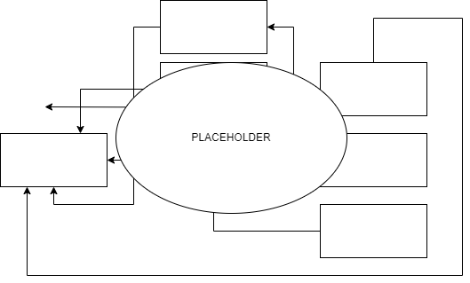

# Virtual Finland MVP Phase 1

## Deployment Environments

The project is deployed to the following environments:

- `mvp-staging`
- `mvp-production`

## Project Components

The project is stored in the following code repositories:

- [Infrastructure](https://github.com/Virtual-Finland-Development/infrastructure)
  - OpenId Connect Provider for CI/CD-pipeline authentication
  - Shared policies etc
  - Must be manually deployed at initial setup deployment
- [Codesets](https://github.com/Virtual-Finland-Development/codesets)
  - Implements the ESCO API
- [Monitoring](https://github.com/Virtual-Finland-Development/monitoring)
  - Service operation dashboards

The component relationships are as follows:

## Deployment

The project is deployed using the Github Actions CI/CD-pipeline defined here: [./.github/workflows/deploy-vf-mvp-phase1.yml](../.github/workflows/deploy-vf-mvp-phase1.yml). The deployments are only started manually.
