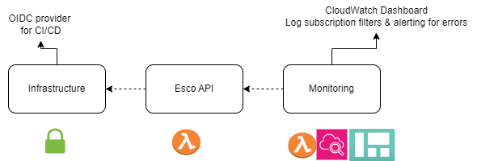

# Virtual Finland MVP Phase 1

## Deployment Environments

The project is deployed to the following environments:

- `mvp-staging`
- `mvp-production`

## Project Components

The project is stored in the following code repositories:

- [Infrastructure](https://github.com/Virtual-Finland-Development/infrastructure)
  - OpenId Connect Provider for CI/CD-pipeline authentication
  - Shared Pulumi policies etc
  - Must be manually deployed at initial deployment
- [Esco API](https://github.com/Virtual-Finland-Development/esco-api)
  - Implements the ESCO API
  - Bun / TypeScript application running with AWS Lambda
- [Monitoring](https://github.com/Virtual-Finland-Development/monitoring)
  - Service operation dashboards
  - Service error alerts

## Deployment

The project is deployed using the Github Actions CI/CD-pipeline defined here: [./.github/workflows/phase1.yml](../.github/workflows/phase1.yml). The deployments are only started manually.
