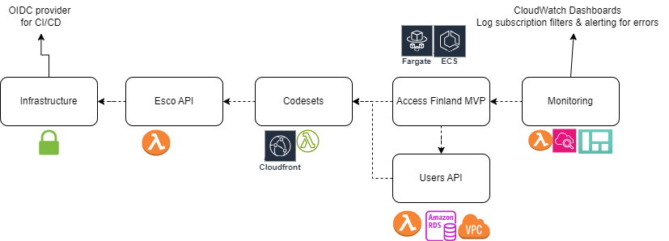

# Virtual Finland MVP Phase 2

## Deployment Environments

The project is deployed to the following environments:

- `mvp-staging`
- `mvp-production`

## Project Components

The project is stored in the following code repositories:

- [Infrastructure](https://github.com/Virtual-Finland-Development/infrastructure)
  - OpenId Connect Provider for CI/CD-pipeline authentication
  - Shared Pulumi policies etc
  - Must be manually deployed at initial deployment
- [Access Finland MVP](https://github.com/Virtual-Finland-Development/access-finland)
  - The graphical user interface of the project
  - A Next.js application running as AWS ECS/Fargate task
- [Users API](https://github.com/Virtual-Finland-Development/users-api)
  - Protected VPC
  - The API for the personal data of the users
  - Aspnet / Entity Framework application running with AWS Lambda
  - Postgresql database running with AWS RDS Aurora
- [Esco API](https://github.com/Virtual-Finland-Development/esco-api)
  - Implements the ESCO API  
  - Bun / TypeScript application running with AWS Lambda
- [Codesets](https://github.com/Virtual-Finland-Development/codesets)
  - Serve static assets (lists of specifications etc) for the project
  - Node.js / TypeScript application running with AWS Cloudfront, Lambda@Edge and S3
- [Monitoring](https://github.com/Virtual-Finland-Development/monitoring)
  - Service operation dashboards
  - Service error alerts

## Deployment

The project is deployed using the Github Actions CI/CD-pipeline defined here: [./.github/workflows/phase2.yml](../.github/workflows/phase2.yml). The deployments are only started manually.
