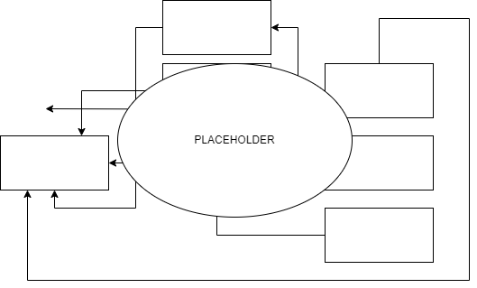

# Virtual Finland MVP Phase 2

## Deployment Environments

The project is deployed to the following environments:

- `mvp-staging`
- `mvp-production`

## Project Components

The project is stored in the following code repositories:

- [Infrastructure](https://github.com/Virtual-Finland-Development/infrastructure)
  - Protected VPC
  - OpenId Connect Provider for CI/CD-pipeline authentication
  - Shared policies etc
- [Virtual Finland MVP](https://github.com/Virtual-Finland-Development/virtual-finland)
  - The graphical user interface of the project
- [Users API](https://github.com/Virtual-Finland-Development/users-api)
  - The API for the personal data of the users
  - Database
- [Authentication Gateway](https://github.com/Virtual-Finland-Development/authentication-gw)
  - Handle the authentication flow with the external authentication providers:
    - Sinuna
- [Codesets](https://github.com/Virtual-Finland-Development/codesets)
  - Serve static assets (lists of specifications etc) for the project
  - Implements the ESCO API

The component relationships are as follows:

## Deployment

The project is deployed using the Github Actions CI/CD-pipeline defined here: [./.github/workflows/deploy-vf-mvp-phase2.yml](../.github/workflows/deploy-vf-mvp-phase2.yml). The deployments are only started manually.
